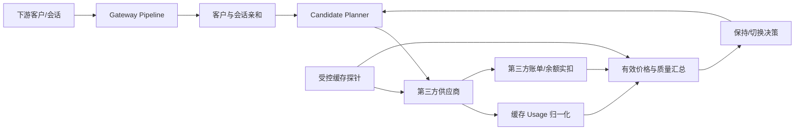

# 第三方 API 有效价格与缓存感知路由

> 状态：MVP、连续窗口自动提升/回滚和管理端证据闭环已实现；首个 `sub2api-compatible` 账单源 Adapter 已支持 API Key 契约检测、持久化配置、余额/额度与聚合快照、手动/定时同步、多实例租约和历史证据，并已联动账单健康、路由硬阻断和经济切换门禁。该契约不提供增量游标、逐请求账单行或价格 Feed；PostgreSQL 16 专用环境仍待验收。
>
> 本专题是 [AsterRouter 省钱系统](../../savemoney/README.md) 在“采购第三方中转站/API 服务商”场景下的实施设计，不建立第二套路由器。

[数据模型与指标](./data-model-and-metrics.md) · [管理端原型](./ui-prototype.md) · [实施计划](./implementation-plan.md) · [上位成本感知设计](../../savemoney/cost-aware-routing.md)

## 1. 结论

AsterRouter 可以提高缓存命中的机会，但不能保证第三方内部或其源头一定命中缓存。

应交付的不是一个“开启缓存”开关，而是以下闭环：

1. 尽量把同一客户、同一会话、同一模型的请求送到同一个第三方供应商和我方采购账号。
2. 对经过验证的第三方能力透传 `session_id`、`prompt_cache_key`、`cache_control` 等缓存或亲和信号。
3. 规范化采集缓存读、缓存写、未缓存输入、TTFT 和第三方实扣成本。
4. 用受控探针识别第三方是否接受缓存字段、是否命中、是否兑现折扣，以及内部号池是否破坏会话亲和。
5. 同时展示标称倍率和缓存调整后的真实有效倍率，防止低倍率制造“便宜”的错觉。
6. 先过滤不合格线路，再按有效采购成本、缓存经济性和服务质量决定保持、推荐切换或自动切换。
7. 将账单监控证据分为“硬阻断”和“仅冻结经济切换”：监控异常不能中断正常推理，但不能继续把不健康候选提升为更优线路。

原始缓存命中率不能单独作为供应商好坏结论。唯一 Prompt 很多的工作负载天然命中低；响应变快也不能单独证明缓存命中。决策必须同时看工作负载可缓存性、响应 Usage、账单实扣和受控探针。

## 2. 业务边界

AsterRouter 的实际采购链路是：

```text
下游调用方
  -> AsterRouter
  -> ProviderConnection（第三方中转站/API 服务商）
  -> ProviderAccount（我方在第三方的采购账号/API Key/套餐）
  -> 第三方内部账号池、区域和源头路由（通常不可见）
```

因此系统只能对以下对象做选择和归因：

- 第三方服务商连接。
- 我方持有的第三方采购账号。
- AsterRouter 的 Gateway Model / Model Route。
- 第三方返回并可验证的上游模型、缓存 Usage 和账单事实。

系统不得：

- 把第三方宣传的 Anthropic、Vertex、Bedrock 等源头当成已验证事实。
- 因为响应延迟低就断言发生缓存命中。
- 用 AsterRouter 对下游的 `model_pricings` 反推采购成本。
- 用 `ProviderAccount.rate_multiplier` 代替供应商账单或可信采购报价。
- 把第三方声称的倍率直接用于自动切换。

如果第三方内部账号池不可见，系统只能标记为 `pool_fragmentation_suspected`，不能声称已经识别到具体内部账号。

## 3. 号池为何会破坏缓存

第三方中转站可能在一个入口后维护数百或数千个订阅账号。即使 AsterRouter 连续调用同一个第三方 API Key，第三方仍可能把相邻请求分配到不同内部账号、组织、区域或 Provider endpoint。源头缓存通常不会跨这些边界共享，于是产生以下现象：

```text
同一会话请求 A -> 第三方入口 -> 内部账号 17 -> 缓存写入
同一会话请求 B -> 第三方入口 -> 内部账号 842 -> 再次冷启动
同一会话请求 C -> 第三方入口 -> 内部账号 31 -> 再次冷启动
```

仅在 AsterRouter 侧固定第三方供应商还不够。第三方还必须满足至少一项：

- 接受并使用会话亲和字段。
- 自己根据稳定 Prompt 前缀执行内部账号粘性。
- 内部缓存域可以跨账号共享。
- 对客户提供固定账号、固定组织或固定缓存的产品组。

`sub2api` 是号池实现的直接参考：它明确提供多账号管理和 Sticky Session，并把会话绑定到内部账号；这说明大型号池要维持缓存，需要在中转内部再次实现亲和，而不能依赖随机轮换。相关代码证据见[来源与查证](#12-来源与查证)。

## 4. 总体架构



所有模块沿用现有 Gateway Pipeline：

- Provider Adapter 解释协议字段和 Usage，不决定线路。
- 价格源插件提交采购报价，不直接改路由。
- Core 计算可信度、有效成本、亲和和切换决策。
- Trace 保存候选、价格版本、缓存证据和切换原因。

## 5. 两级亲和路由

### 5.1 供应商亲和

目标是让同一客户的请求尽量保持在同一个第三方供应商，减少跨供应商缓存域切换。

建议绑定维度：

```text
tenant/customer + gateway principal + model family + route group + policy version
```

供应商亲和使用较长 TTL，例如 1 小时到 24 小时，由管理员按业务配置。它只固定第三方供应商，不要求同一客户的所有并发请求挤在一个采购账号上。

### 5.2 会话与采购账号亲和

目标是在已选供应商内，尽量复用同一个我方 Provider Account，并向第三方传递其已验证的亲和信号。

建议绑定维度：

```text
credential + requested model/route group + protocol + session hash
```

会话键按以下优先级获得：

1. 现有 `X-AsterRouter-Sticky-Key`。
2. 协议中明确、稳定且允许作为会话标识的字段，例如 OpenAI 请求的 `user`。
3. 经过租户隔离的会话元数据。
4. 没有会话键时，回退到短时客户亲和，而不是对 Prompt 全文做长期绑定。

存储前使用实例密钥做 HMAC，Trace 只保存哈希和来源，不保存原始客户标识。第一阶段复用现有 Header，不再新增同义 Header。

向已验证第三方注入 `prompt_cache_key` 时使用客户/会话/模型/协议/供应商账号共同派生的稳定 HMAC，不为整个租户复用单一 Key。OpenAI 当前文档明确说明稳定 Key 能帮助共享长前缀的请求路由到同一缓存，同时建议高流量按稳定映射拆分 Key，避免单个 key-prefix 过热导致缓存溢出；第三方中转站是否采用相同机制仍以 AsterRouter 探针和 Usage 观测为准。

### 5.3 有界粘性

亲和只在合格候选中提权，不能覆盖以下门禁：

- 凭据、模型、地区、数据和能力策略。
- 禁用、过期、余额不足或人工隔离。
- 健康、熔断、冷却、429 和失败率。
- 并发、RPM、TPM 和预算。
- 缓存能力明显劣化或有效成本持续超阈值。

若粘性候选只是短时满载，可在 Direct 请求允许的短窗口内等待；超过窗口则故障转移并记录 `affinity_break_reason`。不能为了缓存让同步请求无限排队。

## 6. 第三方缓存能力识别

每个 `provider_account + upstream_model + protocol` 维护独立状态：

| 状态 | 含义 |
| --- | --- |
| `unknown` | 没有足够样本 |
| `claimed` | 文档或销售声称支持，尚未实测 |
| `accepted` | 缓存/亲和字段未被拒绝，但未观察到命中 |
| `observed` | 响应 Usage 已观察到缓存读或写 |
| `billed_verified` | 响应 Usage 与第三方实扣折价一致 |
| `degraded` | 曾验证有效，近期命中或账单一致性显著下降 |
| `unsupported` | 多次受控探针确认不支持或明确拒绝 |

能力识别分为四层，不能跳级：

1. **协议接受：** 字段是否被第三方接受和透传。
2. **Usage 可见：** 是否返回缓存读写 Token；字段缺失与值为 0 必须区分。
3. **行为有效：** 在相同前缀、相同会话和 TTL 内是否稳定命中。
4. **经济兑现：** 第三方账单或余额实扣是否确实下降。

同时维护 `pool_affinity_grade`：

| 等级 | 判断 |
| --- | --- |
| `verified` | 同会话探针稳定命中，生产样本一致，账单可验证 |
| `probable` | 同会话明显优于不同会话，但账单证据不足 |
| `opaque` | 无内部账号信息，样本不足 |
| `fragmented` | 稳定前缀和会话信号下仍持续冷写/未命中，且负对照正常 |

## 7. 受控缓存探针

探针只使用无敏感信息的合成长前缀，并受每日 Token 和金额预算约束。

单次探针序列：

1. 选择明确支持的模型，使稳定前缀达到该模型最低缓存 Token。
2. 用固定 `probe_session_id` 发首个请求建立缓存，输出上限尽量小。
3. 在 TTL 内发送相同前缀、变化后缀的第二个请求。
4. 再发送突变前缀或不同会话 ID 作为负对照。
5. 采集响应 Usage、TTFT、第三方请求 ID、账单行和余额变化。
6. 重复多个时间窗口；单次 Miss 不直接判坏。

探针必须具备：

- 账号、模型和协议级冷却。
- 每日 Token/金额预算与全局并发上限。
- 首次响应开始后才发送复用请求，避免缓存尚未可读。
- 生产流量优先，容量紧张时自动跳过。
- 完整审计、手动停用和 `observe_only` 默认模式。

探针不能发送客户 Prompt，也不能为了达到最低 Token 而复制客户内容。

## 8. 真正价格与倍率

页面必须并列展示四个概念：

| 指标 | 用途 |
| --- | --- |
| 标称倍率 | 第三方宣传或采购合同的报价，不代表实扣 |
| 账单倍率 | 第三方实扣相对同口径官方未缓存基准的倍率 |
| 缓存调整后有效倍率 | 当前真实工作负载包含缓存读写后的采购成本倍率 |
| 标准化有效倍率 | 用统一工作负载/探针缓存分布比较供应商，减少流量结构偏差 |

文本请求的采购成本为：

```text
actual_input_cost
  = uncached_input_tokens * uncached_input_price
  + cache_write_5m_tokens * cache_write_5m_price
  + cache_write_1h_tokens * cache_write_1h_price
  + cache_read_tokens * cache_read_price

actual_request_cost
  = recharge_multiplier * (
      actual_input_cost
      + output_tokens * output_price
      + request_fee
      + other_usage_dimension_cost
    )
```

真实有效倍率为：

```text
official_uncached_equivalent_cost
  = total_input_tokens * official_input_price
  + output_tokens * official_output_price

workload_effective_multiplier
  = actual_procurement_cost / official_uncached_equivalent_cost
```

只有总扣费而没有输入、输出、缓存分项时，可以展示“全请求有效成本”和 `derived/estimated` 可信度，不能伪造精确的 Input/M、Output/M 或缓存单价。创建采购价必须显式提交未缓存输入、缓存读、缓存写 5m/1h、输出、请求费和官方输入/输出基准；明确免费填 `0`，缺失字段直接拒绝，避免把未配置误当成免费。

详细口径见[数据模型与指标](./data-model-and-metrics.md)。

## 9. 供应商选择与切换依据

决策不是“缓存高就切”，而是分四步：

### 9.1 硬过滤

先排除能力、治理、健康、容量、余额、模型或协议不合格的供应商。缓存和价格不能让不合格线路重新进入候选。

### 9.2 可比性门禁

只有模型能力、请求约束、计费单位和数据时间窗口可比时，才比较有效成本。数据过期或样本不足时保持当前稳定供应商并输出建议，不自动切换。

切换决策必须同时保存两个不同语义的模型字段：

- `gateway_model`：客户请求中的公共模型名，用于 AsterRouter 热路径匹配决策。
- `upstream_model`：第三方 API 实际承接的模型名，用于绑定采购价、缓存 Usage、账单、错误率和 P95 证据。

当前与候选线路只有在 `upstream_model + protocol` 相同且采购账号不同的情况下才允许比较。公共模型名不能从上游模型自动推断，否则模型别名或路由映射会让决策无法命中，或把多模型账号的成本与缓存证据串用。

### 9.3 经济排序

优先比较同一工作负载下的预计有效采购成本。若存在可信且显著更低的供应商，进入切换评估；不能仅因标称倍率更低就切换。

### 9.4 缓存质量决胜

如果没有供应商在有效成本上形成显著优势，则在服务质量合格的供应商中优先：

1. `billed_verified` 等级更高。
2. 同会话缓存经济收益更高。
3. 号池亲和一致性更高。
4. 缓存 Usage 覆盖和账单一致性更高。
5. 错误率和延迟不劣于当前线路。

默认切换阈值建议作为可配置初值，而不是硬编码业务事实：

- 至少 200 个合格请求或多轮成功探针。
- 至少覆盖 24 小时，并同时参考 7 天窗口。
- 有效成本改善至少 8%。
- 当成本改善不足时，缓存 Token 命中率至少改善 10 个百分点且缓存净节省率真实提高，或号池亲和一致率至少改善 10 个百分点，才允许进入缓存质量决胜。高命中但缓存读不打折的线路不能因此胜出。
- 缓存质量决胜最多容忍候选有效成本回退 2%；超过该值必须保持当前线路。
- 账单一致率至少 95%。
- 错误率不得恶化超过 0.5 个百分点。
- P95 延迟不得恶化超过 20%，除非企业明确选择 `cost_first`。
- 连续 3 个评估窗口满足条件才提升；连续 2 个窗口劣化才经济降级。

对应策略字段为 `min_cache_hit_rate_improvement=0.10`、`min_affinity_improvement=0.10`、`max_cache_tiebreak_cost_regression=0.02`、`max_error_rate_regression=0.005` 和 `max_p95_latency_regression=0.20`。缓存决胜还要求当前与候选均能由完整缓存分项和采购价计算净节省；缺失时记录 `cache_economics_evidence_missing`。缓存或亲和胜出且所有门禁通过时才记录 `cache_quality_tiebreaker`；错误率、P95 或证据缺失分别记录 `error_rate_regression_exceeded`、`p95_latency_regression_exceeded`、`p95_latency_evidence_missing` 并保持当前线路。`cost_first` 只允许跳过 P95 门禁，不能跳过错误率、样本、覆盖率、账单一致性和成本可信度门禁。

紧急故障转移不受经济滞回限制。经济切换默认走 `observe_only -> recommend -> canary -> active`。Canary 使用客户级 HMAC cohort key 做稳定分桶；已有客户/会话绑定继续复用到期或因硬故障中断，尚无有效绑定的客户按 Canary 比例进入候选供应商，避免同一客户因 Prompt 不同在供应商之间跳动。

## 10. 管理界面

页面布局、交互状态和桌面/移动端线框见[管理端原型](./ui-prototype.md)。

### 10.1 有效价格对比

按模型和协议展示供应商行：

- 标称倍率、账单倍率、缓存调整后有效倍率。
- 标称 Input/Output/Cache Read/Cache Write 价格。
- 观测有效输入单价和全请求有效成本。
- 合格请求命中率、Token 命中率、写读比、净缓存节省。
- 账单验证等级、样本数、数据新鲜度和置信区间。
- 当前供应商、建议供应商、预计节省与切换原因。

### 10.2 缓存与号池质量

按第三方供应商和采购账号展示：

- 缓存能力状态和亲和等级。
- 生产流量与受控探针分开的指标。
- 同会话复用率、意外换供应商率和亲和中断原因。
- 受控探针的首写、复用、负对照和账单结果。
- `pool_fragmentation_suspected`、字段剥离、折价不兑现等异常。

### 10.3 切换中心

每条建议必须解释：

- 当前线路与候选线路。
- 使用的价格、Usage、账单和探针版本。
- 预计有效成本差、可靠性差和缓存差。
- 触发阈值、样本量和不确定性。
- 预计影响的未绑定客户 cohort 比例、现有绑定到期时间和回滚条件。

## 11. MVP 交付状态与剩余边界

已交付：

- OpenAI-compatible、Anthropic 与 Gemini JSON/SSE 缓存 Usage 归一化，区分字段缺失和值为 0，并采集 TTFT、第三方请求 ID、缓存读写 Token；Gemini 按 `promptTokenCount`、`cachedContentTokenCount`、`cacheTokensDetails` 和 `candidatesTokenCount + thoughtsTokenCount` 计算有效输入/输出。
- 采购报价、第三方账单行、Usage 对账、采购成本可信度、标称倍率、真实有效倍率、无缓存等效成本和缓存净节省报告；充值实付系数实际进入成本计算，报告用 `cost_available` 区分零成本与缺失证据；下游 `model_pricings` 语义保持不变。
- 客户级供应商亲和、会话级采购账号亲和和 HMAC 绑定键；亲和只重排合格候选，不覆盖健康、容量、熔断和 Fallback。生产网关会按 `provider_account + upstream_model + protocol` 查询已验证能力，并以不暴露原始客户/会话标识的 HMAC 值注入第三方 Header、Body 字段或 `prompt_cache_key`；能力查询失败时请求继续转发，同时在 Route Reason 记录 `upstream cache affinity unavailable`。
- 可选 Redis-compatible 原子亲和协调层：Lua 单键首写保证多实例并发首次请求只有一个供应商/账号 owner，同 owner 可刷新 TTL，不同 owner 不能覆盖；Redis 故障时回退现有 Memory/PostgreSQL Repository。真实 Redis 已验证 64 路并发首写、过期/刷新和 10,000 个账号绑定，启用方式为 `ASTER_ROUTING_AFFINITY_DRIVER=redis`。
- `warm -> reuse -> negative_control` 受控探针、Token/金额预算、账号冷却、并发门禁、原子预算预留，以及连续三次有效失败后的疑似号池碎片化判断。
- 生产流量与探针样本分离，缓存能力、账单一致性、有效价格和切换原因可独立审计。
- `observe_only/recommend/canary/active/rollback` 决策链路，以及成本优势不足时受最大成本回退约束的缓存质量决胜；缓存决胜同时要求命中率达标和净节省率真实提高，候选错误率和成功请求 P95 相对当前线路越界或证据缺失时保持当前线路。
- 连续窗口监控、持久化健康/劣化 streak 和不可变窗口证据；同一决策窗口通过唯一约束和事务在多实例间只累计一次。自动动作默认关闭，Canary 仍需人工批准；启用后默认连续 3 个健康窗口自动激活、连续 2 个真实劣化窗口自动回滚，证据不足只记为 `inconclusive`。
- `provider_billing_sources`、`provider_billing_sync_runs`、`provider_balance_snapshots` 和 `provider_usage_aggregate_snapshots` 持久化闭环；配置使用版本 CAS，定时任务使用 `FOR UPDATE SKIP LOCKED` 和租约 fencing，多实例只认领一次，过期 run 显式记为 `lease_expired`。成功事务原子写入快照，失败只保存稳定错误码和审计，不保存第三方错误正文。
- 管理端有效价格、缓存质量、切换中心、探针记录、账单源五个 Tab，支持完整缓存读写采购价录入、第三方亲和能力配置、真实错误率/P95 对比、完整策略阈值、预算确认、账单源检测/配置/立即同步/历史证据和桌面/移动响应式布局。

仍待完成：

- `sub2api-compatible` 没有增量游标、逐请求账单行或价格 Feed，因此仍需保留人工账单/报价导入，不能用聚合金额制造请求级对账；后续只能在第三方真实提供对应契约时扩展能力位。
- 为提供稳定逐请求账单 API 或签名价格 Feed 的其他第三方增加具体 Adapter。
- 在专用 PostgreSQL 16 环境完成 clean install、历史升级、重复初始化和运行时 Schema parity 实测；当前 PostgreSQL 18 隔离实例已通过 clean schema、重复迁移、Repository 契约和 Schema parity。

## 12. 来源与查证

查证时间：2026-07-15。

### 官方缓存行为

- [OpenAI Prompt Caching](https://developers.openai.com/api/docs/guides/prompt-caching.md)：精确前缀匹配、最低 Token、稳定 `prompt_cache_key` 的缓存路由、高流量稳定分片、缓存读写 Usage 和保留策略。该口径已通过 Context7 `/websites/developers_openai_api` 于 2026-07-15 复核。
- [Anthropic Prompt Caching](https://platform.claude.com/docs/en/build-with-claude/prompt-caching.md)：`cache_control`、tools/system/messages 前缀顺序、5 分钟/1 小时 TTL、缓存读写 Usage 与价格倍率。
- [Gemini Context Caching](https://ai.google.dev/gemini-api/docs/caching)：隐式缓存默认行为、稳定前缀建议和缓存 Token Usage。
- [Gemini generateContent Caching](https://ai.google.dev/gemini-api/docs/generate-content/caching)：显式缓存对象、TTL 与 Usage。
- [Gemini GenerateContent API](https://ai.google.dev/api/generate-content)：`promptTokenCount` 包含缓存内容的有效 Prompt 总量，`cachedContentTokenCount` 是缓存子集，`cacheTokensDetails` 提供缓存模态明细，`candidatesTokenCount + thoughtsTokenCount` 构成完整输出；该字段口径已通过 Context7 `/websites/ai_google_dev_api` 于 2026-07-15 复核。

### 中转站行为参考

- [OpenRouter Prompt Caching](https://openrouter.ai/docs/guides/best-practices/prompt-caching.md)：同会话固定 Provider endpoint、`session_id`、`cached_tokens`、`cache_write_tokens` 和 `cache_discount`。这是中转站可实现能力的参考，不代表所有第三方都支持。
- [sub2api README](https://github.com/Wei-Shaw/sub2api/blob/e316ebf52838a89d57fc790981cce7520f819ac8/README.md#L170-L212)：多账号管理、Sticky Session，以及代理丢弃 `session_id` 会破坏多账号粘性的说明。
- [sub2api 会话哈希与绑定](https://github.com/Wei-Shaw/sub2api/blob/e316ebf52838a89d57fc790981cce7520f819ac8/backend/internal/service/gateway_service.go#L721-L803)：从稳定信号派生会话键，并把会话绑定到具体内部账号。
- [sub2api 负载感知调度](https://github.com/Wei-Shaw/sub2api/blob/e316ebf52838a89d57fc790981cce7520f819ac8/backend/internal/service/gateway_scheduling.go#L89-L180)：从缓存读取 Sticky Account，账号不可用或容量不足时才进入等待/回退。
- [sub2api 用户 Usage 接口](https://github.com/Wei-Shaw/sub2api/blob/e316ebf52838a89d57fc790981cce7520f819ac8/backend/internal/handler/usage_handler.go#L223-L418)：`/api/v1/usage` 和 `/api/v1/usage/stats` 使用用户 JWT，可返回分页逐请求明细，但 AsterRouter 的采购账号 API Key 不能直接使用该认证面。
- [sub2api API Key Usage 接口](https://github.com/Wei-Shaw/sub2api/blob/e316ebf52838a89d57fc790981cce7520f819ac8/backend/internal/handler/gateway_handler.go#L1229-L1494)：`/v1/usage` 使用采购调用所用 API Key，返回钱包余额、Key 配额或订阅周期额度，以及今日/累计和默认近 30 天模型维度的成本、Token、缓存 Token 聚合；不返回逐请求账单行、账单行 ID、价格 Feed 或增量游标。
- [sub2api API Key 鉴权边界](https://github.com/Wei-Shaw/sub2api/blob/e316ebf52838a89d57fc790981cce7520f819ac8/backend/internal/server/middleware/api_key_auth.go#L29-L150)：支持 `Authorization: Bearer`、`x-api-key` 和 `x-goog-api-key`，并仅对 `/v1/usage` 跳过计费执行以允许查询已耗尽 Key 的用量。

这些来源证明“稳定前缀 + 会话/Provider endpoint 亲和”能提高命中机会，但不能证明某一家待采购第三方已经实现。`sub2api-compatible` 结构匹配同样不能确认对方就是 sub2api 或识别其内部具体账号。因此第三方供应商仍必须经过 AsterRouter 自己的生产观测、探针和账单验证。
