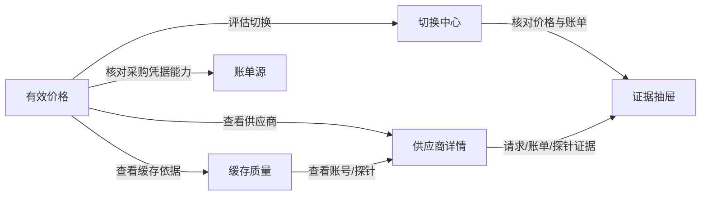
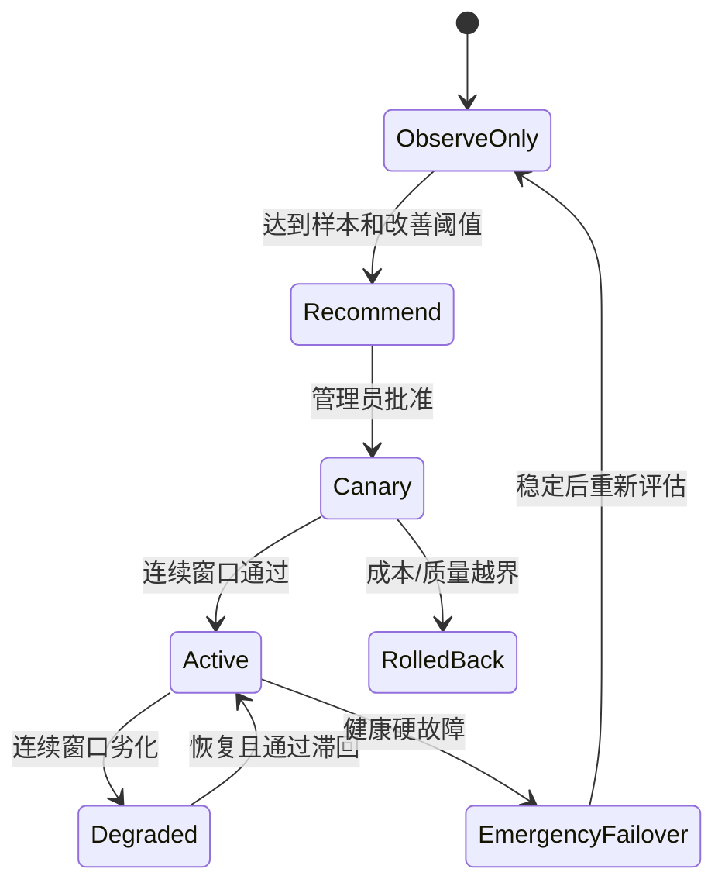

# 管理端原型

> 本原型对应 [第三方 API 有效价格与缓存感知路由](./README.md)。页面中的供应商名称和数值均为示意数据，不代表真实报价或评测结果。

[总体方案](./README.md) · [数据模型与指标](./data-model-and-metrics.md) · [实施计划](./implementation-plan.md)

## 0. 可浏览原型图

原型已整理为一个无需后端即可打开的静态页面：[prototype.html](./prototype.html)。页面包含五个 Tab、价格证据抽屉、完整采购价弹窗、第三方缓存能力配置、Canary 审批弹窗、受控探针和账单源能力检测；账单源历史区同时展示路由健康、硬阻断、自动经济切换资格和原因码，所有数值均为示意数据。

桌面端有效价格页：


桌面端缓存质量页：


桌面端缓存感知采购价：


桌面端第三方缓存能力配置：


桌面端切换中心：


移动端有效价格摘要：


桌面端受控探针预算确认：


移动端受控探针预算确认：


桌面端账单源路由健康：


移动端账单源路由健康：


真实 Vue 管理端采购价弹窗验收：


截图验收口径：桌面端覆盖 `1440×900` 和 `1280×800`，移动端覆盖 `390×844`；移动端不使用横向宽表，缓存缺失、估算价格和疑似号池碎片均保留明确文字状态。采购价弹窗必须覆盖缓存读、5 分钟写、1 小时写、输出、请求费、充值系数、官方基准和来源；能力弹窗必须覆盖亲和传输、字段、缓存控制和 Usage Schema。探针弹窗必须展示账号、模型、协议、合成前缀 Token、金额上限、预计请求量、每日预算和冷却，并在管理员明确确认前禁用提交。

## 1. 信息架构



建议在现有管理端“推理与路由”下增加一级入口“有效价格”，页内使用五个 Tab：

```text
有效价格 | 缓存质量 | 切换中心 | 探针记录 | 账单源
```

供应商详情复用现有 Provider Account 详情入口，不再创建一套供应商管理页面。

## 2. 有效价格对比

目标：第一眼看出“宣传倍率”和“我们实际支付的倍率”是否一致，并能判断缓存差异是否足以改变供应商选择。

```text
┌──────────────────────────────────────────────────────────────────────────────────────────────┐
│ 有效价格                                                        [导出] [策略设置]             │
│ [模型: claude-* ▼] [协议: Anthropic ▼] [窗口: 24 小时 ▼] [客户: 全部 ▼] [仅可比 ✓]         │
├──────────────────────────────────────────────────────────────────────────────────────────────┤
│ 当前模型基准  官方未缓存等价成本 ¥42.80/M   数据截至 18:30   账单覆盖 96.4%                 │
├──────────┬────────┬────────┬────────┬──────────┬────────┬────────┬────────┬─────────────────┤
│ 供应商   │ 标称   │ 账单   │ 有效   │ 有效/无缓存│ 缓存读│ 写/读  │ 可信度 │ 建议            │
│ /账号    │ 倍率   │ 倍率   │ 倍率   │ /净节省  │ 占比   │ 比     │        │                 │
├──────────┼────────┼────────┼────────┼──────────┼────────┼────────┼────────┼─────────────────┤
│ ● 渠道 A │ 0.20x  │ 0.61x  │ 0.68x  │ ¥29.10   │ 12.4%  │ 1.72   │ 派生   │ 降低权重        │
│   采购 1 │ 宣传价 │        │        │ ¥31.80/8.5%│       │        │ 3.2k   │ [查看依据]      │
├──────────┼────────┼────────┼────────┼──────────┼────────┼────────┼────────┼─────────────────┤
│ ✓ 渠道 B │ 0.55x  │ 0.54x  │ 0.43x  │ ¥18.40   │ 67.8%  │ 0.21   │ 实扣   │ 当前默认        │
│   采购 2 │        │        │        │ ¥42.80/57%│        │        │ 12.8k  │ [查看依据]      │
├──────────┼────────┼────────┼────────┼──────────┼────────┼────────┼────────┼─────────────────┤
│   渠道 C │ 0.38x  │   -    │ 0.47x* │ ¥20.10*  │ 59.1%  │ 0.34   │ 估算   │ 建议 Canary     │
│   采购 3 │        │        │        │          │        │        │ 820    │ [评估切换]      │
└──────────┴────────┴────────┴────────┴──────────┴────────┴────────┴────────┴─────────────────┘
 * 估算值不参与正式节省 KPI；鼠标悬停显示价格版本、样本窗口和计算口径。
```

### 2.1 展示规则

- 默认排序使用“标准化有效成本”，不是标称倍率。
- 标称倍率仅作为普通列，不使用绿色或“最低价”强化。
- `exact/derived/estimated/unallocated/unknown` 以文字显示，颜色只是辅助。
- 缓存价格结构直接显示缓存读取、5 分钟写入、1 小时写入相对未缓存输入的倍率；写入溢价不能被命中率隐藏。
- `cost_available=false` 显示“未配置采购价”，与已验证的零成本严格区分。
- 样本不足、价格过期和账单不一致时，价格后显示 `*`，操作降级为“观察”。
- 行点击打开证据抽屉；“评估切换”只进入决策页，不直接改变生产路由。

### 2.2 价格拆解抽屉

```text
┌───────────────────────────────────────────────┐
│ 渠道 B / 采购 2                         [×]   │
├───────────────────────────────────────────────┤
│ 工作负载有效倍率                         0.43x │
│ 标称倍率                                 0.55x │
│ 差异                                     -21.8%│
├───────────────────────────────────────────────┤
│ 输入成本拆解                                   │
│ 未缓存输入   3.2M × ¥3.00/M             ¥9.60 │
│ 缓存写入     0.4M × ¥3.75/M             ¥1.50 │
│ 缓存读取     7.1M × ¥0.30/M             ¥2.13 │
│ 输出         0.8M × ¥15.00/M           ¥12.00 │
├───────────────────────────────────────────────┤
│ 账单匹配  12,284 / 12,742 请求          96.4% │
│ 价格快照  price_20260714_1830                  │
│ 数据窗口  2026-07-13 18:30 → 2026-07-14 18:30 │
│ [查看账单样本] [查看计算明细]                  │
└───────────────────────────────────────────────┘
```

没有成本分项时只显示“请求总成本、请求数、平均请求成本”，隐藏输入拆解，不能用总额倒推出虚假单价。

### 2.3 缓存感知采购价弹窗

管理员录入采购报价时必须一次覆盖以下真实计价维度：

```text
供应商/采购账号  上游模型  协议  币种
未缓存输入       缓存读取  缓存写入 5m  缓存写入 1h
输出             单请求费  标称倍率      充值实付系数
官方输入基准     官方输出基准  可信度      报价来源/合同编号
```

任一缓存写价格缺失时，页面可以展示现有观测，但不得把缓存净节省标为可用于自动切换。明确为零的费用显示为零，不能显示成缺失。

## 3. 缓存与号池质量

目标：区分“客户 Prompt 不适合缓存”“AsterRouter 打散会话”和“第三方内部号池疑似打散”三类问题。

```text
┌──────────────────────────────────────────────────────────────────────────────────────────────┐
│ 缓存质量            [生产流量 ●] [受控探针 ○]     [窗口: 7 天 ▼] [最小样本: 200 ✓]         │
├──────────┬──────────┬────────┬────────┬────────┬────────┬────────┬───────────┬──────────────┤
│ 供应商   │ 能力状态 │ 指标   │ 合格命 │ Token  │ 写/读  │ 账单一 │ 号池亲和  │ 判断         │
│ /模型    │          │ 覆盖率 │ 中率   │ 命中率 │ 比     │ 致率   │ 一致率    │              │
├──────────┼──────────┼────────┼────────┼────────┼────────┼────────┼───────────┼──────────────┤
│ 渠道 A   │ degraded │ 99.2%  │ 18.0%  │ 12.4%  │ 1.72   │ 94.1%  │ 31.5%     │ 疑似号池碎片 │
│ claude-* │          │        │        │        │        │        │           │ [查看探针]   │
├──────────┼──────────┼────────┼────────┼────────┼────────┼────────┼───────────┼──────────────┤
│ 渠道 B   │ billed   │ 98.7%  │ 74.2%  │ 67.8%  │ 0.21   │ 99.3%  │ 96.8%     │ 正常         │
│ claude-* │ verified │        │        │        │        │        │           │ [查看探针]   │
├──────────┼──────────┼────────┼────────┼────────┼────────┼────────┼───────────┼──────────────┤
│ 渠道 C   │ observed │ 61.3%  │ 69.5%* │ 59.1%* │ 0.34   │   -    │ 82.0%*    │ 样本不足     │
│ claude-* │          │        │        │        │        │        │           │ [继续观察]   │
└──────────┴──────────┴────────┴────────┴────────┴────────┴────────┴───────────┴──────────────┘
```

### 3.1 第三方缓存与亲和能力配置

缓存质量列表每行提供“配置能力”，用于录入第三方明确公开或经过受控验证的字段：

```text
供应商/采购账号  上游模型  协议  能力状态
亲和传输 none/header/body  亲和字段
缓存控制 passthrough_if_present/prompt_cache_key
Usage Schema
```

号池亲和等级、生产命中率、账单一致率和探针结果是系统观测字段，只读展示；管理员不能通过配置弹窗把供应商手工标成 `verified`。亲和字段必须通过保留字段校验，且只有能力为 `accepted/observed/billed_verified` 时才进入请求注入。

### 3.2 单供应商时间线

```text
缓存读占比
80% ┤                         ╭────── 渠道 B
60% ┤       ╭─────────────────╯
40% ┤  ─ ─ ─ ─ 评估下限
20% ┤╭──╮  ╭──╮  ╭── 渠道 A
 0% ┼╯  ╰──╯  ╰──╯────────────────────────────────
    7/08  7/09  7/10  7/11  7/12  7/13  7/14

     ● 7/11 14:20  渠道 A 同会话探针连续 3 次 Miss
     ● 7/12 09:10  渠道 A 账单有效倍率升至 0.68x
     ● 7/12 11:00  系统建议未绑定客户 cohort 切到渠道 B
```

时间线必须允许同时叠加“亲和中断事件”和“价格快照变更”，避免把 AsterRouter 主动 Fallback 误判为第三方缓存失败。

## 4. 切换中心

目标：让管理员在执行前看清收益、风险、证据和影响范围。

```text
┌──────────────────────────────────────────────────────────────────────────────────────────────┐
│ 客户网关模型：claude-sonnet   上游模型：claude-3-5-sonnet   Anthropic Messages              │
│ 切换评估只比较同一上游模型和协议；网关模型用于命中客户请求。                 状态：建议 Canary   │
├───────────────────────────────┬──────────────────────────────────────────────────────────────┤
│ 当前：渠道 A / 采购 1         │ 候选：渠道 B / 采购 2                                     │
│ 有效倍率              0.68x   │ 有效倍率              0.43x                               │
│ 24h 实扣           ¥2,910.00  │ 同流量预计         ¥1,840.00                               │
│ 缓存 Token 命中       12.4%   │ 缓存 Token 命中       67.8%                               │
│ 缓存净节省              8.5%   │ 缓存净节省             57.0%                               │
│ 号池亲和一致率         31.5%   │ 号池亲和一致率         96.8%                               │
├───────────────────────────────┴──────────────────────────────────────────────────────────────┤
│ 门禁                                                                                         │
│ ✓ 模型/协议可比   ✓ 账单验证   ✓ 样本 12.8k   ✓ 错误率未恶化   ✓ P95 延迟未越界            │
│ ✓ 连续 3 个窗口满足   ✓ 候选余额充足   ! 现有有效绑定 286 个，将按 TTL 到期                │
├──────────────────────────────────────────────────────────────────────────────────────────────┤
│ Canary 比例  [ 5% ▼]   客户稳定分桶 [✓]   观察窗口 [2 小时 ▼]                              │
│ 回滚条件：错误率 +0.5pp / P95 +20% / 有效成本不再改善                                       │
│                                                                    [保持当前] [启动 Canary]  │
└──────────────────────────────────────────────────────────────────────────────────────────────┘
```

新建评估弹窗必须把“网关模型”和“供应商上游模型”作为两个独立字段。网关模型不从报告行自动填写，管理员需按现有模型路由显式确认；上游模型和协议从报告证据选择，当前/候选下拉框只显示该维度下可比较的不同采购账号。

质量门禁原因码使用实现中的精确值：`error_rate_regression_exceeded`、`p95_latency_regression_exceeded`、`p95_latency_evidence_missing`。只有成本优势不足、缓存/亲和改善达标且全部质量门禁通过时，才显示 `cache_quality_tiebreaker`。

### 4.1 状态流



### 4.2 操作约束

- “启动 Canary”是唯一高强调操作。
- 默认只对未绑定客户做稳定分桶；现有健康客户/会话保持原绑定。
- 紧急故障转移不显示成本审批，但仍展示触发原因和回滚目标。
- `estimated/unallocated/unknown` 成本不能直接启用自动提升。
- 策略弹窗提供独立“自动提升与自动回滚”开关、评估间隔、连续健康窗口和连续劣化窗口；开关默认关闭，且只在 `canary/balanced/cost_first` 模式生效。
- 切换卡展示最近窗口结论、健康/劣化 streak 和窗口结束时间，并可打开窗口证据抽屉查看成本、缓存命中、错误率、原因码和自动动作。
- 每次审批显示策略版本，并写入 Audit Log。

## 5. 账单源检测

目标：在接入自动同步前先回答“这个采购 API Key 实际能提供什么”，避免看见一个余额字段就误认为已经接入精确账单。

```text
┌────────────────────────────────────────────────────────────────────────────┐
│ 第三方账单源检测                                                           │
│ [采购账号: 渠道 A / 采购 1 ▼]                              [自动检测]      │
├────────────────────────────────────────────────────────────────────────────┤
│ schema_match  sub2api_compatible · sub2api_v1_usage · 证据 0123456789abcdef│
├────────────┬────────────┬────────────┬────────────┬─────────────────────────┤
│ 逐请求账单 │ 聚合用量   │ 余额/额度  │ 增量同步   │ 价格 Feed               │
│ 不可用     │ 可用       │ 可用       │ 不可用     │ 不可用                   │
├────────────────────────────────────────────────────────────────────────────┤
│ API Key 剩余额度                                             $7.50         │
├────────┬────────┬──────────┬──────────┬──────────┬──────────┬──────────────┤
│ 范围   │ 请求   │ 输入     │ 输出     │ 缓存读取 │ 模型原价 │ 第三方实扣   │
│ 累计   │ 10     │ 500      │ 80       │ 200      │ $8.00    │ $4.25        │
│ claude-sonnet · 近 30 天│ 7 │ 350     │ 60       │ 180      │ $6.50    │ $3.25        │
└────────┴────────┴──────────┴──────────┴──────────┴──────────┴──────────────┘
```

展示规则：

- `schema_match` 只说明响应结构兼容，不能显示成“已识别第三方就是 sub2api”。
- 钱包余额、API Key 配额和订阅周期额度使用三个不同标签。
- 聚合 `actual_cost` 只能进入校验证据，不能显示成已导入账单行。
- 逐请求账单、增量游标和价格 Feed 不存在时必须明确显示“不可用”。
- 失败响应不展示第三方原始 Body，避免错误页中的 Secret 或账户信息泄漏。

同步与历史证据区在余额历史前增加路由健康摘要：

```text
┌────────────────────────────────────────────────────────────────────────────┐
│ 路由健康       降级          硬阻断 否       自动经济切换 否                │
│ 证据观测       7/15 16:00    路由依据：账单同步连续失败 · 证据已过期       │
└────────────────────────────────────────────────────────────────────────────┘
```

`observe_only/disabled` 显示为“仅观测/已停用”，不会被误标记为故障；硬阻断只用于明确的 Key 无效、认证拒绝或额度耗尽。同步失败、过期和缺失证据只显示为“降级”，并解释为“禁止自动经济切换”，不宣称第三方推理不可用。

## 6. 供应商详情

详情页在现有 Provider Account 页面增加以下 Tab：

```text
概览 | 路由与容量 | 有效价格 | 缓存 | 账单对账 | 探针 | Trace
```

“缓存”Tab：

```text
┌────────────────────────────────────────────────────────────────────────────┐
│ 渠道 B / 采购 2 / claude-*                                  billed_verified │
├────────────────────────────────────────────────────────────────────────────┤
│ 亲和传输      body.session_id      缓存模式      cache_control passthrough │
│ 首次命中      2026-07-08 10:42     最近验证      2026-07-14 18:12          │
│ 号池亲和      verified             数据新鲜度    18 分钟                   │
├────────────────────────────────────────────────────────────────────────────┤
│ 最近探针                                                                  │
│ 18:12  warm              写 4,096 / 读 0        实扣 ¥0.0150              │
│ 18:13  reuse             写 0 / 读 4,096        实扣 ¥0.0012              │
│ 18:14  negative_control  写 4,096 / 读 0        实扣 ¥0.0150              │
│                                                     [查看完整证据] [重跑]  │
└────────────────────────────────────────────────────────────────────────────┘
```

“重跑”先进入预算确认弹窗，显示预计 Token、金额、冷却和当日已用额度，不能直接发送探针。

## 7. 证据抽屉

所有列表使用同一个证据抽屉组件，避免不同页面各自解释一套成本：

```text
摘要 | 价格快照 | Usage 样本 | 账单匹配 | 探针序列 | 路由 Trace
```

最小字段：

- 时间窗口、模型、协议、供应商和采购账号。
- 标称报价来源、价格快照 ID 和有效期。
- Usage Schema、缓存字段是否存在及归一化状态。
- 账单行匹配数量、未匹配数量和可信度。
- 亲和绑定复用/中断次数及原因。
- 切换决策 ID、阈值和策略版本。

证据抽屉不能显示客户 Prompt、原始 API Key 或第三方凭据。

## 8. 空状态与异常状态

| 状态 | 页面表现 | 可用操作 |
| --- | --- | --- |
| 无采购报价 | 有效价格显示“未配置采购价” | 配置价格源 |
| 有报价无账单 | 显示估算值和 `estimated` | 接入账单/继续观察 |
| 缓存字段缺失 | 命中率显示“-”，不是 0% | 查看能力/运行探针 |
| 明确返回 0 | 显示 0%，并保留样本量 | 查看工作负载/探针 |
| 样本不足 | 数值加 `*`，禁止自动切换 | 延长观察窗口 |
| 价格过期 | 行降级，退出自动排序 | 同步价格 |
| 账单不一致 | 显示阻断状态 | 查看对账异常 |
| 疑似号池碎片化 | 显示风险说明，不断言内部账号 | 查看同会话探针 |
| 供应商硬故障 | 显示 Fallback 结果和原因 | 查看 Trace/恢复评估 |

## 9. 移动端原型

移动端不压缩桌面宽表，改为供应商摘要列表和详情页：

```text
┌──────────────────────────────┐
│ 有效价格       [claude-* ▼] │
├──────────────────────────────┤
│ 渠道 B / 采购 2       当前  │
│ 有效倍率 0.43x               │
│ 标称 0.55x · 实扣验证        │
│ 缓存命中 67.8% · 12.8k 样本 │
│ [查看依据]                   │
├──────────────────────────────┤
│ 渠道 C / 采购 3       候选  │
│ 有效倍率 0.47x*              │
│ 标称 0.38x · 估算            │
│ 缓存命中 59.1% · 820 样本   │
│ [查看依据] [评估]            │
└──────────────────────────────┘
```

移动端只保留核心比较字段；完整价格拆解、账单和探针进入独立详情页，不使用横向滚动宽表。

## 10. 前端落点

建议路由：

```text
/admin/effective-pricing
/admin/effective-pricing/cache
/admin/effective-pricing/switches
/admin/effective-pricing/probes
/admin/provider-accounts/:id?tab=effective-price
```

建议组件边界：

```text
EffectivePricingView
  EffectivePricingFilters
  EffectivePricingTable
  PricingEvidenceDrawer

CacheQualityView
  CacheQualityTable
  CacheQualityTimeline
  CacheProbeEvidence

SupplierSwitchView
  SwitchComparison
  SwitchGuardrails
  CanaryApprovalDialog
```

筛选、表格、抽屉和审批对话框复用现有管理端样式与权限模型。第一阶段不做自定义仪表盘编辑器，也不允许从价格列表直接绕过审批切生产路由。

## 11. 原型验收

- 用户无需打开账单详情就能看出标称倍率与真实有效倍率的差异。
- 用户可以录入并比较缓存读、缓存写、请求费和充值折扣，不再只填未缓存输入价。
- 管理员可以从缓存质量页配置经过确认的第三方亲和字段，系统观测的号池等级保持只读。
- 缓存字段缺失不会显示成 0% 命中。
- 生产命中率和受控探针结果可以切换查看，且不会混在同一分母。
- 号池风险使用“疑似”表达，并能追溯同会话探针和亲和中断事件。
- 切换前能看见成本、缓存、质量、样本、现有会话和回滚条件。
- 经济切换默认只作用于未绑定客户 cohort；紧急故障转移有独立状态。
- 桌面宽表和移动摘要均不截断供应商名称、倍率、金额和状态文字。
- 账单源页能直接区分“不能路由”和“仍可推理但不能自动切价”；硬阻断、经济切换资格和原因码在桌面/移动端均可读。
