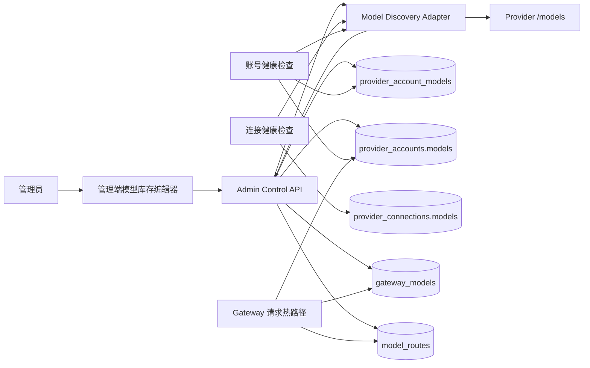
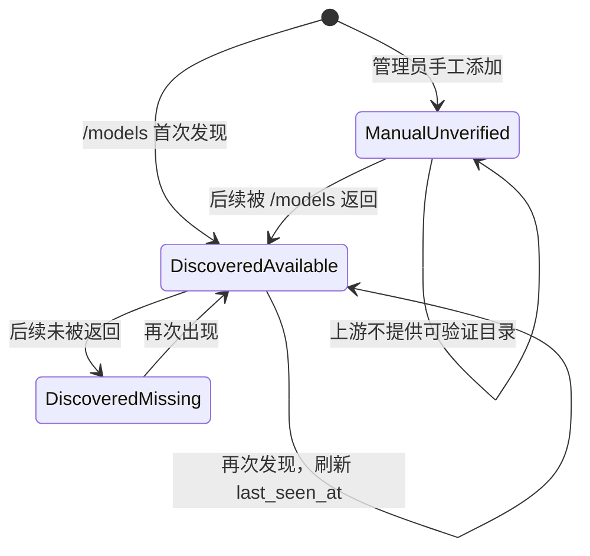
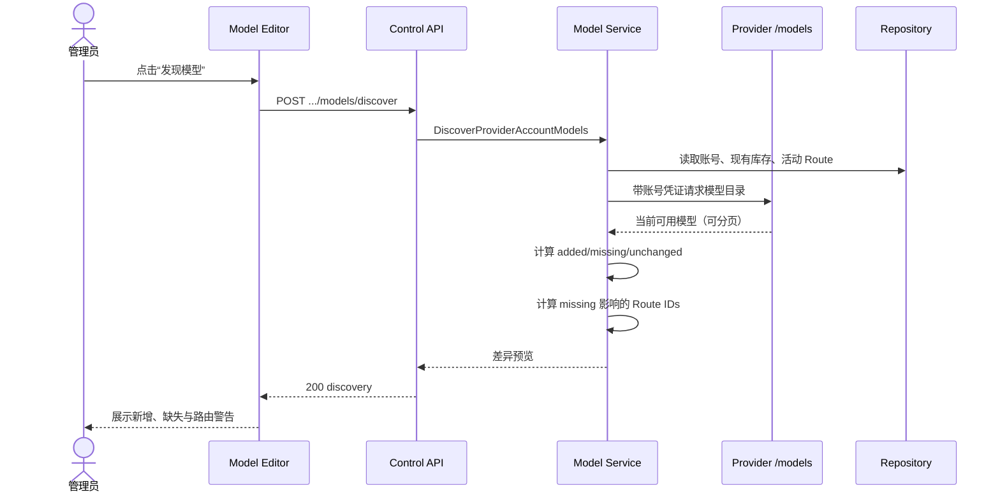
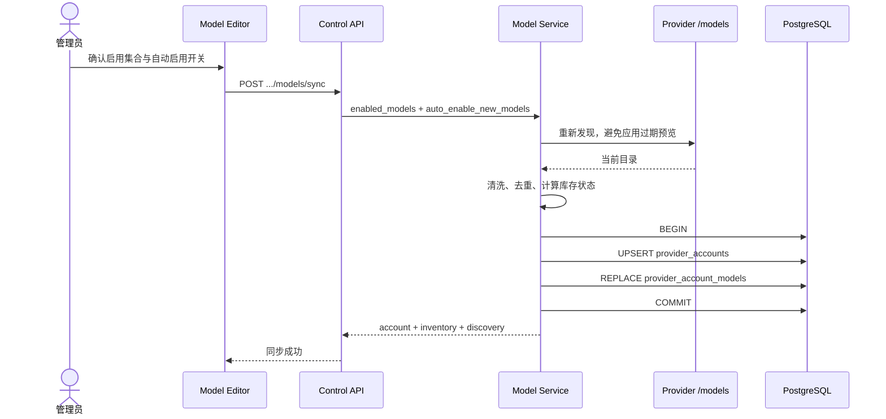
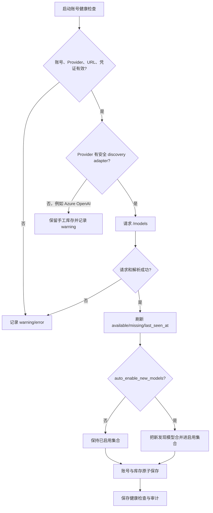
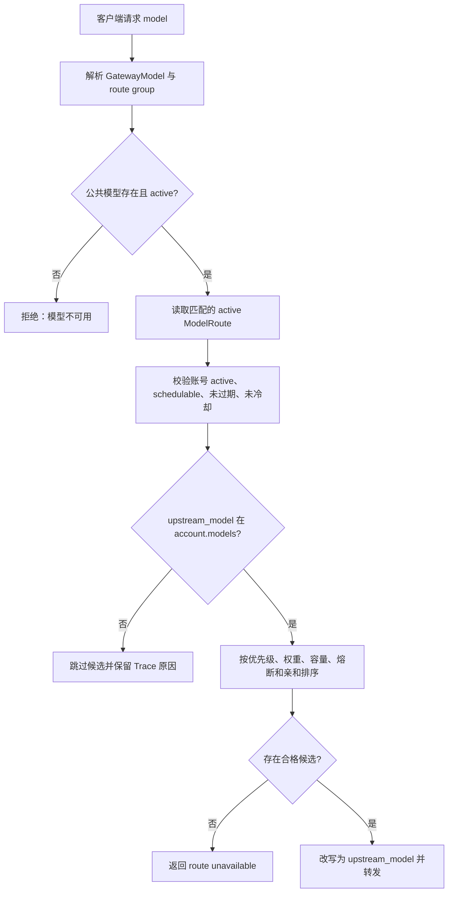
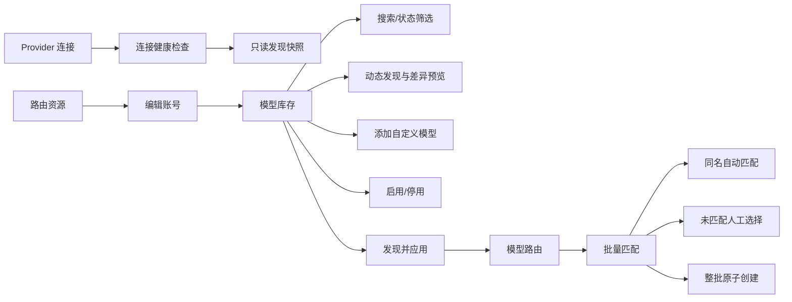
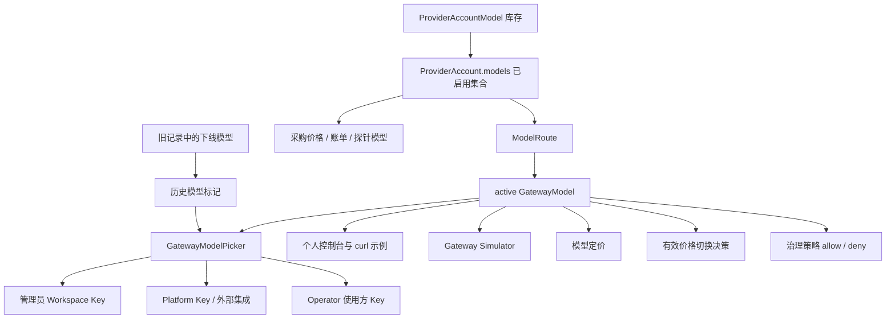

# 模型目录、库存与路由治理

> 状态：已实施
> 最后更新：2026-07-16
> 相关指引：[模型更新与运维指南](./UPDATE_GUIDE.md)

## 1. 结论

AsterRouter 不维护一份写死在代码或前端中的“最新完整模型列表”。模型发布速度、账号授权、区域、套餐和上游兼容性都在变化，任何随版本发布的静态列表都会过期。

当前实现采用一个观察快照和四层路由事实：

1. `ProviderConnection.models` 是连接级健康检查最近发现的模型快照，只用于观察，不是配置入口。
2. `ProviderAccountModel` 保存某个采购账号真实发现或手工配置的上游模型库存。
3. `ProviderAccount.models` 仍是网关热路径的已启用模型集合。
4. `GatewayModel` 是对客户端稳定、可治理的公共模型标识。
5. `ModelRoute` 显式连接公共模型、路由组、采购账号和上游模型。

新模型通过账号的 `/models` 能力动态进入库存，默认只预览、不自动启用；管理员确认后一次性同步。上游消失的模型标记为 `missing`，保留关联路由证据，不会被静默删除。

## 2. 为什么不是静态全集

“所有最新模型”不是一个全局事实，而是多个事实的交集：

```text
供应商发布目录
  ∩ 账号实际授权
  ∩ 区域/套餐可用性
  ∩ 上游接口真实返回
  ∩ AsterRouter 管理员启用范围
  ∩ 对外 GatewayModel 与路由策略
```

因此，本方案承诺的是“对每个账号持续获得最新、完整、可追溯的实际库存”，而不是“发布一份看起来很全但无法证明可用的名称表”。

## 3. 参考实现与取舍

| 项目 | 有价值的设计 | 不直接照搬的部分 | AsterRouter 选择 |
| --- | --- | --- | --- |
| OpenRouter | `/api/v1/models` 提供稳定 ID、能力、上下文、价格、生命周期；Provider endpoint 与公共模型分离；路由支持 order、fallback、延迟/吞吐排序和数据策略 | OpenRouter 是统一托管市场，能掌握 endpoint 全局事实；自托管网关通常只能看到自身账号 | 分离公共模型、账号库存和显式路由；库存以账号实测为准 |
| LiteLLM | 大规模可更新模型元数据目录；模型组、部署和 fallback 分层 | 中央 JSON 元数据不能证明某个账号此刻可调用 | 外部元数据未来可作为注释源，不能替代账号发现和健康事实 |
| Portkey Gateway / Models | Gateway 配置负责 fallback、负载均衡；模型仓库独立维护 2,000+ 模型的价格与配置 | 社区目录更新频繁，价格和能力仍需来源、版本和可信度 | 运行时库存与价格目录解耦，不把价格数据混入路由真相 |
| new-api | Channel/Ability 能表达模型可用性，并提供“已引用但缺少模型元数据”的检查 | Channel 字符串、Ability、模型元数据和 mapping 容易形成多处事实源 | 使用规范化库存表和 Route 外键，不依赖 JSON mapping 作为唯一关系 |
| sub2api | 支持额外模型、分组模型配置和模型映射链，适合中转号池 | 聚合字段便于配置，但来源、最后发现时间、缺失状态和路由影响不够直接 | 每个账号、每个模型一行，明确 source、availability、enabled 和时间证据 |

2026-07-16 复核 OpenRouter 当前文档时，公共 Model 已同时返回 `canonical_slug`、模态、上下文、支持参数、价格和 `expiration_date`，Provider endpoint 则单独返回延迟、吞吐、uptime、量化和 Provider 级价格。这进一步说明“公共产品目录”和“可路由 Provider endpoint”必须分层，不能合并成一个模型字符串数组。

关键来源：

- [OpenRouter Models API](https://openrouter.ai/docs/guides/overview/models)
- [OpenRouter Provider Routing](https://openrouter.ai/docs/guides/routing/provider-selection)
- [LiteLLM](https://github.com/BerriAI/litellm) 与其可更新的 [model_prices_and_context_window.json](https://github.com/BerriAI/litellm/blob/main/model_prices_and_context_window.json)
- [Portkey Gateway](https://github.com/Portkey-AI/gateway) 与 [Portkey Models](https://github.com/Portkey-AI/models)
- 本地参考：[new-api/model/channel.go](/Users/coso/Documents/dev/go/new-api/model/channel.go)、[new-api/model/missing_models.go](/Users/coso/Documents/dev/go/new-api/model/missing_models.go)
- 本地参考：[sub2api channel monitor schema](/Users/coso/Documents/dev/go/sub2api/backend/ent/schema/channel_monitor.go)、[sub2api group schema](/Users/coso/Documents/dev/go/sub2api/backend/ent/schema/group.go)

## 4. 设计原则

- 动态发现：从账号真实接口取得模型，不在前端写供应商模型数组。
- 显式启用：发现事实和路由授权是不同动作，默认不自动扩大范围。
- 稳定对外：客户端使用 `GatewayModel.model_id`，不直接依赖供应商名称。
- 可追溯：保留来源、首次发现、最后发现、缺失和受影响路由。
- 不静默破坏：上游缺失不自动删除模型或 Route。
- 热路径简单：请求调度继续读取 `ProviderAccount.models + ModelRoute`，不在请求时调用 `/models`。
- 原子变更：账号与库存同事务保存；批量路由先完整校验，再同事务写入。
- 目录只读：Provider CRUD 即使收到兼容字段 `models` 也会忽略；更新连接配置会保留最近发现快照。
- 失效关闭：active Route 只能绑定 active `GatewayModel`；disabled 公共模型只允许保留 disabled 历史 Route。

## 5. 系统架构



解释：

- Control Plane 负责发现、比较、审核和配置。
- Data Plane 只读取已持久化事实，不等待上游目录接口。
- `provider_account_models` 是库存与证据；`provider_accounts.models` 是启用快照。
- `provider_connections.models` 仅是最近一次连接级发现快照，Provider 表单不允许手工维护它。
- `gateway_models` 和 `model_routes` 是客户端稳定性与供应商替换的隔离层。

## 6. 领域边界

| 对象 | 单一职责 | 是否进入请求热路径 |
| --- | --- | --- |
| `ProviderConnection` | Provider 类型、Base URL、连接级凭证、状态和最近发现快照；快照不授权路由 | 是（模型快照否） |
| `ProviderAccount` | 采购账号、容量、健康、启用模型和凭证 | 是 |
| `ProviderAccountModel` | 账号模型库存、来源和发现证据 | 否 |
| `GatewayModel` | 对客户端公开的稳定模型 ID、模态和默认路由组 | 是 |
| `ModelRoute` | 公共模型到账号上游模型的显式映射 | 是 |
| `ProviderAccountHealthCheck` | 某次探测的模型集合、延迟和结果 | 否 |

## 7. 数据模型

```mermaid
erDiagram
    PROVIDER_CONNECTION ||--o{ PROVIDER_ACCOUNT : owns
    PROVIDER_ACCOUNT ||--o{ PROVIDER_ACCOUNT_MODEL : inventories
    PROVIDER_ACCOUNT ||--o{ PROVIDER_ACCOUNT_HEALTH_CHECK : observes
    GATEWAY_MODEL ||--o{ MODEL_ROUTE : exposes
    PROVIDER_ACCOUNT ||--o{ MODEL_ROUTE : serves

    PROVIDER_ACCOUNT {
        text id PK
        text provider_id FK
        text models "enabled snapshot"
        boolean auto_enable_new_models
        text status
    }
    PROVIDER_ACCOUNT_MODEL {
        text provider_account_id PK_FK
        text model_id PK
        text source "discovered|manual"
        boolean enabled
        text availability "available|missing|unverified"
        timestamptz first_seen_at
        timestamptz last_seen_at
        timestamptz updated_at
    }
    GATEWAY_MODEL {
        text id PK
        text model_id UK
        text modality
        text default_route_group
        text status
    }
    MODEL_ROUTE {
        text id PK
        text gateway_model_id FK
        text provider_account_id FK
        text route_group
        text upstream_model
        int priority
        int weight
        text status
    }
```

数据库约束：

- 库存主键为 `(provider_account_id, model_id)`。
- `source` 仅允许 `discovered | manual`。
- `availability` 仅允许 `available | missing | unverified`。
- 账号删除时库存级联删除。
- 批量 Route 在服务层检测现存重复和批次内重复，PostgreSQL 事务保证不部分写入。

## 8. 库存状态机



`enabled` 与状态机正交：可用模型可以不启用，缺失模型也可以暂时保持启用，以便管理员先迁移 Route。

## 9. API 契约

| 方法 | 路径 | 语义 |
| --- | --- | --- |
| `GET` | `/admin/provider-accounts/:id/models` | 读取库存、自动启用配置和 Route 计数 |
| `POST` | `/admin/provider-accounts/:id/models/discover` | 实时发现并返回差异预览，不修改启用集合 |
| `POST` | `/admin/provider-accounts/:id/models/sync` | 重新发现、校验并原子保存启用集合与库存 |
| `POST` | `/admin/model-routes/bulk` | 最多 500 条，整批预校验后原子创建 Route |

所有接口沿用现有 Admin 鉴权和审计边界。响应不会返回账号密钥。

API Key、治理策略和外部集成中的 allowlist/denylist 是兼容历史配置和分阶段部署的软引用，不承担模型存在性。管理端新建操作只提供 active `GatewayModel.model_id`；请求执行时 `ResolveGatewayModel` 再次只解析 active GatewayModel，因此直接 API 写入未知或已停用字符串也不能绕过公共模型目录或产生路由候选。

Provider CRUD 中的 `models` 仅为旧客户端 wire compatibility 保留，服务端忽略创建值并在更新时保留当前发现快照。`enabled_models=[]` 是合法同步请求，用于显式停用账号的全部模型；库存行和发现证据继续保留，账号因无可用 Route 不会进入调度。

## 10. 模型发现预览时序



预览不保存启用变更，避免一次网络探测直接改变生产路由面。

## 11. 同步应用时序



重新发现是有意设计：预览与点击应用之间，上游目录可能已变化。

## 12. 健康检查自动更新流程



默认 `auto_enable_new_models=false`。启用自动模式意味着管理员接受供应商新模型进入账号可路由集合，但仍不会自动创建公共 `GatewayModel` 或 `ModelRoute`。

## 13. 请求路由流程



库存表不参与每次请求查询，避免控制面扩展影响网关延迟。

## 14. Provider Adapter 覆盖

| Provider 类型 | 发现方式 | 规范化 | 当前状态 |
| --- | --- | --- | --- |
| `openai_compatible` | `GET {base_url}/models`，Bearer Token | 读取 `data[].id`、`models[].id` 或数组 `id` | 已实现 |
| `self_hosted` | OpenAI-compatible `/models` | 同上 | 已实现 |
| `anthropic` | `GET {base_url}/models`，`x-api-key`，按 `after_id` 分页 | 读取 `data[].id` | 已实现 |
| `gemini` | `GET {base_url}/models`，`x-goog-api-key`，按 `pageToken` 分页 | `models/{id}` 规范化为 `{id}` | 已实现 |
| `azure_openai` | 需要 Azure Management Plane 枚举 deployment | 无管理面凭证时不能可靠发现 | 明确手工模式 |

所有 adapter 都有 15 秒超时、2 MiB 单页上限和最多 100 页限制。发现请求禁止跟随重定向，避免凭证被转发到其他主机。

## 15. 管理端信息架构



新建账号允许以空库存保存。创建成功后弹窗切换为编辑态并立即执行动态发现预览，管理员勾选允许模型后再原子应用；不支持目录发现的 Azure deployment 或私有上游才需要添加自定义模型。空库存账号没有可建立的 ModelRoute，不会参与请求转发。

Provider 连接页面不提供推荐模型、手工模型或白名单输入。连接级健康检查复用同一组 discovery adapter，并用本次发现结果整体替换只读快照，确保已下线模型不会永久残留。

### 15.1 GatewayModel 消费路径



所有新建公共模型表单只展示 `status=active` 的 `GatewayModel.model_id`。编辑旧 Key、策略、集成、定价或 Route 时，如果原值已不在 active 目录中，界面保留并标记为历史模型，由管理员显式移除；系统不会在一次页面加载中静默改写既有授权。采购价格、第三方账单、缓存探针和能力证据使用所选账号的 `ProviderAccount.models`，而不是公共模型目录或 Provider 连接快照。

## 16. 兼容与迁移

迁移 `065_provider_account_model_inventory.sql`：

- 为 `provider_accounts` 增加 `auto_enable_new_models`，默认 `false`。
- 新增 `provider_account_models` 及查询索引。
- 旧账号无需离线回填；首次读取会把 `provider_accounts.models` 投影为 `manual/unverified`。
- 旧账号首次编辑、健康检查或同步时，库存会在同一事务中持久化。
- 网关热路径和现有 API 的 `models` 字段保持兼容。

## 17. 实施位置

| 能力 | 代码 |
| --- | --- |
| 库存领域与服务 | `backend/internal/controlplane/provider_account_model*.go` |
| 账号原子保存 | `backend/internal/controlplane/repository.go` |
| 批量 Route 服务与事务 | `gateway_model_service.go`、`gateway_model_repository.go` |
| Admin HTTP API | `backend/internal/server/admin_routes.go` |
| 数据库迁移 | `backend/migrations/065_provider_account_model_inventory.sql` |
| 前端 API 和类型 | `frontend/src/api/control.ts`、`frontend/src/types.ts` |
| 库存编辑器 | `frontend/src/components/provider/ProviderAccountModelEditor.vue` |
| 公共模型选择器 | `frontend/src/components/model/GatewayModelPicker.vue` |
| 管理页面 | `AdminProvidersView.vue`、`AdminProviderAccountsView.vue`、`AdminModelRoutesView.vue` |
| GatewayModel 消费页面 | `AdminApiKeysView.vue`、`AdminPoliciesView.vue`、`AdminGatewaySimulatorView.vue`、`AdminModelPricingsView.vue`、`AdminEffectivePricingView.vue`、`ConsoleHomeView.vue`、`PlatformKeysView.vue`、`PlatformIntegrationsView.vue`、`OperatorCustomersView.vue` |

## 18. 验证矩阵

| 风险 | 覆盖 |
| --- | --- |
| 新增、缺失、手工模型状态错误 | Service 单元测试 |
| 缺失模型的活动 Route 未提示 | Service 单元测试 |
| 默认意外自动启用 | 健康检查回归测试 |
| Anthropic/Gemini 分页遗漏 | Adapter 单元测试 |
| 重定向泄露账号密钥 | 重定向拒绝测试 |
| 批量 Route 部分写入 | Memory 与 PostgreSQL 事务测试 |
| 迁移不可重复执行或约束失效 | Migration schema 测试 |
| 前端 API 路径漂移 | API contract 测试 |
| 管理端发现、同步、批量匹配回归 | Vue 组件与页面测试 |
| 静态推荐模型再次进入 Provider 弹窗 | Provider 页面回归测试与硬编码扫描 |
| Key 或 curl 示例误用 Provider 快照 | API Key 与 Console 页面回归测试 |
| 下线模型在编辑时被静默删除 | `GatewayModelPicker` 历史模型测试 |
| Provider CRUD 伪造或覆盖发现快照 | Service 只读快照回归测试 |
| disabled 公共模型获得新 active Route | Service 拒绝测试与 Route 页面 active 目录测试 |
| 账号无法显式清空启用集合 | Service 与库存编辑器空集合测试 |
| 有效价格页混用公共模型和上游模型 | 页面级动态目录测试 |

## 19. 后续边界

当前版本不把 OpenRouter、LiteLLM 或 Portkey 的公共元数据自动写入运行时库存，因为它们不能证明本地采购账号可用。以后若引入模型能力和价格 Feed，必须作为独立、带来源与版本的 metadata snapshot，并保持以下优先级：

```text
账号实时发现 > 管理员显式启用 > 公共目录注释
```

公共目录可以补充显示名、上下文、模态、能力和参考价格，不能直接创建生产 Route 或覆盖账号发现事实。
